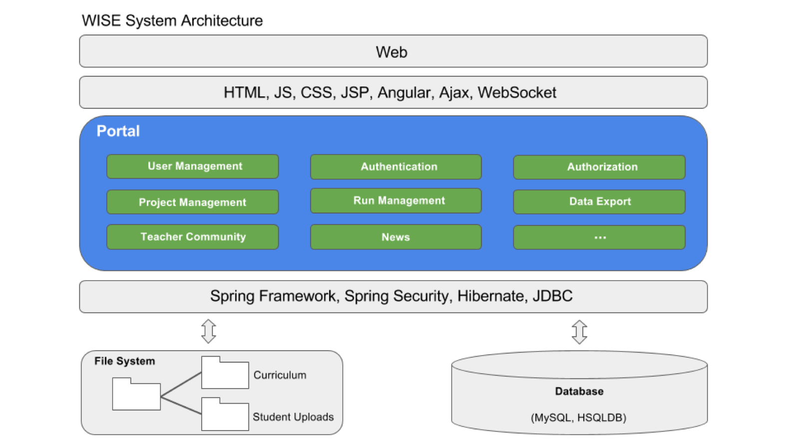
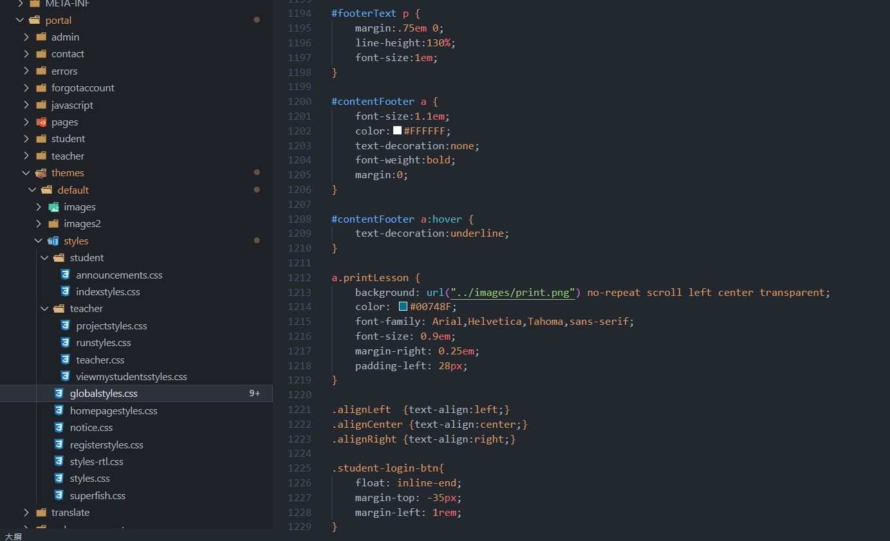
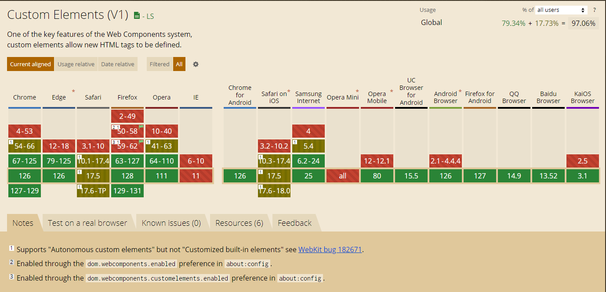
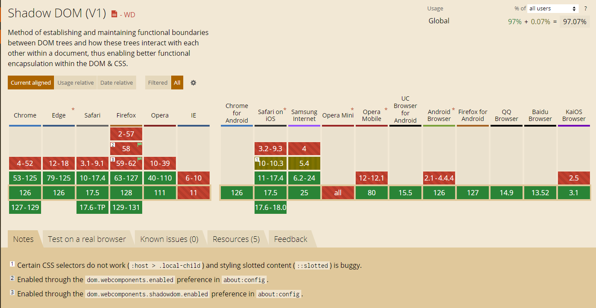

# 什麼是 Web Components

不借助任何框架，只使用原生的 HTML、CSS、JavaScript 來編寫元件。

---

# 為什麼選擇 Web Components

## 情境1: 多系統共用元件


---

## 情境2: 系統過於複雜時



---

## 情境3: 全域 CSS 干擾

  

---

# 快速開始

1. class的this
   - [範例0](https://github.com/HsienLu/web-component/blob/main/src/ex0.html)
2. web component 基本架構
   - [範例1](https://github.com/HsienLu/web-component/blob/main/src/ex1-basic.html)
3. web component另一種形式
   - [範例2](https://github.com/HsienLu/web-component/blob/main/src/ex2-option-parameter.html)

---

# 快速開始 - 解釋

1. 架構
2. 烤肉串命名:至少帶有一個連字符號
3. 防護罩:變數汙染

```js
class HelloWorld extends HTMLElement {
  constructor() {
    super();
    this.attachShadow({mode: "open"});
    this.shadowRoot.innerHTML = `
                    <style>
                        h1 {
                            color: blue;
                        }

                    </style>
                    <h1>Hello World</h1>
                `;
  }
}
window.customElements.define("hello-world", HelloWorld);
```

---

# Web Components 的組成

- [Shadow DOM](https://developer.mozilla.org/zh-CN/docs/Web/API/Web_components/Using_shadow_DOM)
- [Custom Elements](https://developer.mozilla.org/zh-CN/docs/Web/API/Web_components/Using_custom_elements)
- [HTML Templates](https://developer.mozilla.org/zh-CN/docs/Web/API/Web_components/Using_templates_and_slots)

<div style="display: flex; justify-content: space-around; margin-top:2rem;gap:0.5rem">
  
  
  
</div>

除非...你要支援IE~~

---

# HTML Templates & Slots

- [範例3](https://github.com/HsienLu/web-component/blob/main/src/ex3-templete.html)

---

## 小結

- 自主自定義元素（Autonomous custom elements）的建構函數只能繼承 `HTMLElement`，且調用 `customElements.define()`
- 客製化內建元素（Customized built-in elements）的建構函數一般只能繼承可用的基本 HTML 標籤類別，且調用 `customElements.define()` 方法時必須要傳入第三個參數，第三個參數一般為： `{extends: "標籤名"}`
- 在 HTML 中直接使用客製化內建元素時，需要通過元件建構函數繼承類的基本標籤名 + `is="自定義標籤名"`
- 可以搭配 `HTML Templates` 和 `Slots` 來實現更複雜的元件結構

---

# 傳值

- [範例4](https://github.com/HsienLu/web-component/blob/main/src/ex4-props.html)

---

# 整齊一點的寫法

- [範例5](https://github.com/HsienLu/web-component/blob/main/src/ex5-adv..html)

---

# 實際應用

Github:https://github.com/HsienLu/HexHexo

Github Pages:https://hex-hexo.vercel.app/

---

<style>
    .centered {
        display: flex;
        justify-content: center;
        align-items: center;
        height: 50vh;
    }
</style>

#

## <div class="centered" style="font-size:48px">到這裡我的分享已經結束了~~但是...</div>

---

# 更進一步-生命週期

- **connectedCallback**: 元件被加入到文檔時調用。
- **disconnectedCallback**: 元件從文檔中移除時調用。
- **attributeChangedCallback**: 元件的屬性改變時調用。
- **adoptedCallback**: 元件被移動到新的文檔時調用。
