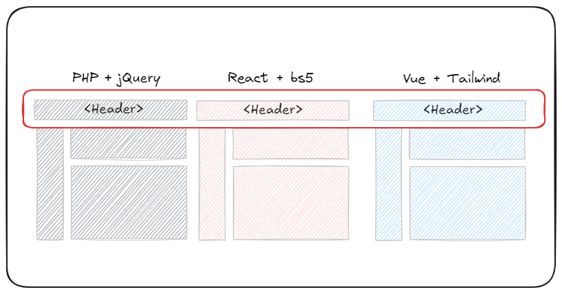
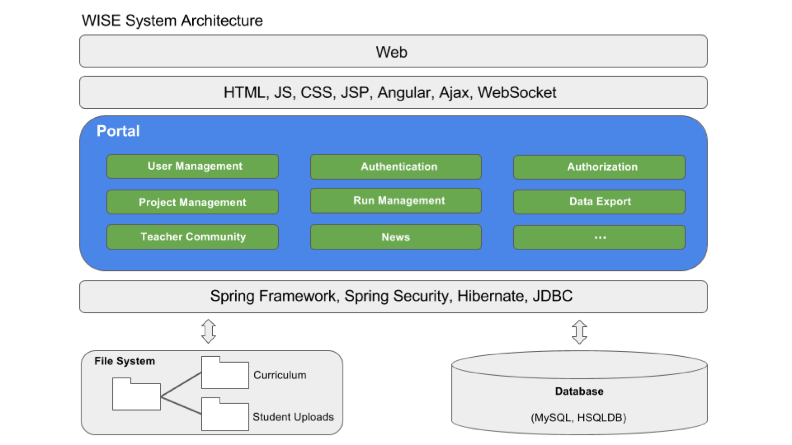
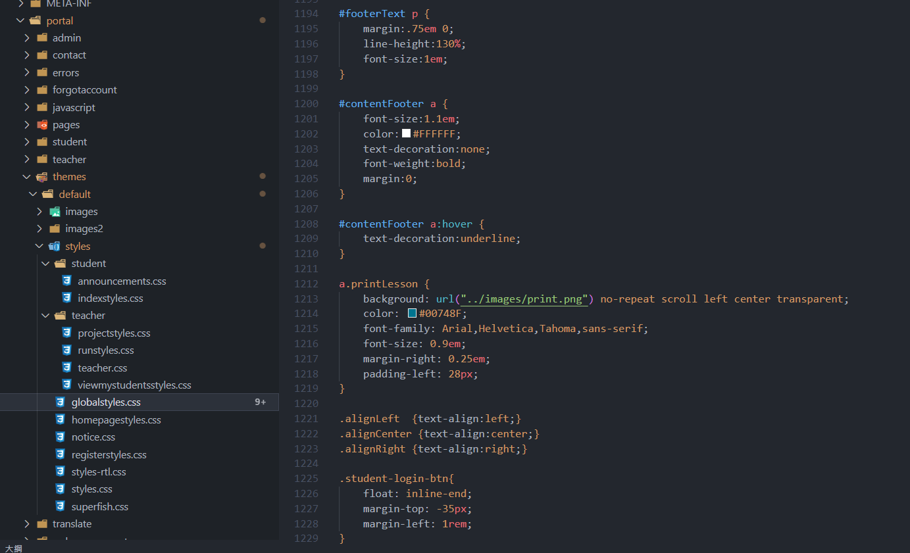
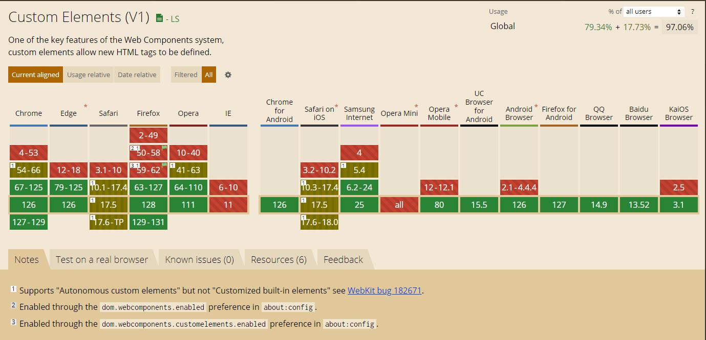
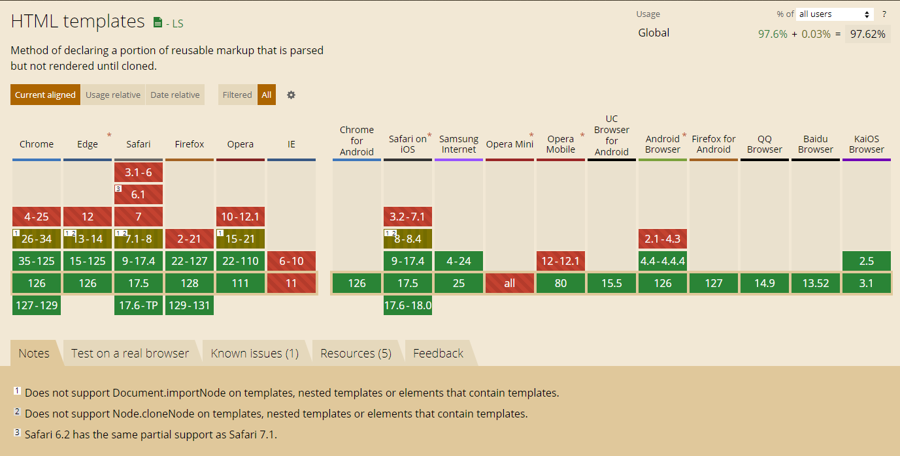

# 什麼是 Web Components
不借助任何框架，只使用原生的 HTML、CSS、JavaScript 來編寫元件。

# 為什麼選擇 Web Components
### 情境1: 多系統共用元件

### 情境2: 系統過於複雜時

### 情境3: 全域 CSS 干擾

# 快速開始
- [範例0](ex0.html)
- [範例1](ex1-basic.html)
- [範例2](ex2-option-parameter.html)

# 快速開始 - 解釋
1. 架構
2. 烤肉串命名
3. 防護罩
4. 變數汙染

# Web Components 的組成
- [Shadow DOM](https://developer.mozilla.org/zh-CN/docs/Web/API/Web_components/Using_shadow_DOM)
- [Custom Elements](https://developer.mozilla.org/zh-CN/docs/Web/API/Web_components/Using_custom_elements)
- [HTML Templates](https://developer.mozilla.org/zh-CN/docs/Web/API/Web_components/Using_templates_and_slots)

## 總結
綜合上述，可以總結如下：
- 自主自定義元素（Autonomous custom elements）的建構函數只能繼承 `HTMLElement`，且調用 `customElements.define()` 方法時不需要第三個參數；
- 在 HTML 中直接使用自主自定義元素定義的標籤名稱即可；
- 自主自定義元素樣式的 `display` 值預設為 `inline`，如有需要，可重新設定；
- 客製化內建元素（Customized built-in elements）的建構函數一般只能繼承可用的基本 HTML 標籤類別，且調用 `customElements.define()` 方法時必須要傳入第三個參數，第三個參數一般為： `{extends: "標籤名"}`；
- 在 HTML 中直接使用客製化內建元素時，需要通過元件建構函數繼承類的基本標籤名 + `is="自定義標籤名"`。
# HTML Templates & Slots
- [範例3](ex3-templete.html)

# 傳值
- [範例4](ex4-props.html)

# 整齊一點的寫法
- [範例5](ex5.html)

# 更進一步
## 生命週期
- **connectedCallback**: 元件被加入到文檔時調用。
- **disconnectedCallback**: 元件從文檔中移除時調用。
- **attributeChangedCallback**: 元件的屬性改變時調用。
- **adoptedCallback**: 元件被移動到新的文檔時調用。